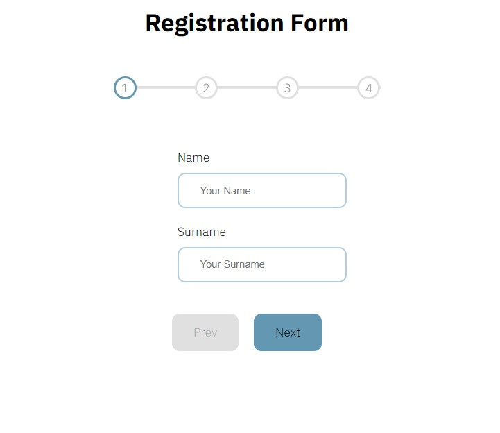

# Registration Form 

My purpose is to create a visually appealling yet a simple web app with some basic React functionality.

NOTE: Progress bar that is used in this project is not designed by me.  

Here is the page of the app.

<br>



---------------------------------
<br>

## Installing the project

```
gh repo clone merv-e/registration-form
cd registration-form 
npm i
```

## Run the project
`npm start`


<br>
### Technologies used in this project: 

```
HTML 
CSS 
JS
React
```